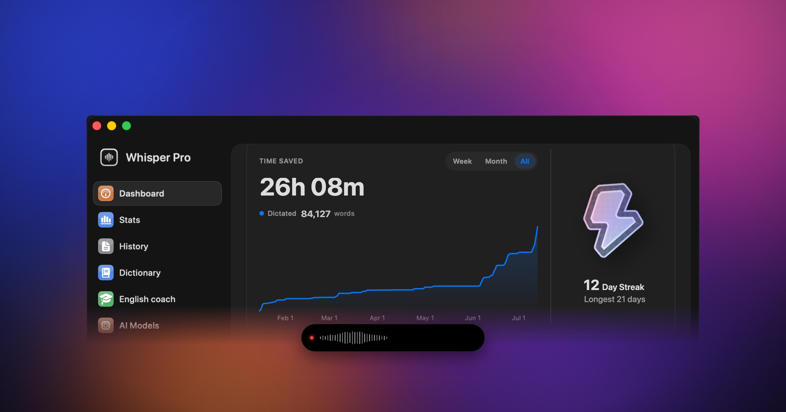

<div align="center">
  
  <h1>Whisper Pro</h1>

  <p align="center">
    
  </p>

  <p>A native macOS app that turns your voice into text, almost instantly.</p>

  
  
</div>

---

Whisper Pro is a personal macOS voice-to-text app: press a hotkey, speak, and the text is
typed in wherever your cursor is. Transcription runs through your own speech-to-text
provider (e.g. Soniox), with optional AI cleanup of the text.

## Why Whisper Pro

- ⚡ **Fastest voice-to-text on macOS**: hotkey, speak, text streams in live
- 🎧 **Auto-pauses your music** while you talk
- ↩️ **Sends on Enter for you**: dictate, and the message is gone
- 🎓 **English coach**, built from what you actually dictate
- 🔌 **Any engine**: cloud (Soniox) or fully local models
- 📝 **Learns your words**: personal dictionary & replacements
- 📊 **Live transcript + stats**: hours saved, streaks

## Install

```bash
brew install --cask zdenekculik/tap/whisper-pro
```

Or download the signed `.dmg` from
[Releases](https://github.com/ZdenekCulik/whisper-pro/releases/latest), open it and drag
Whisper Pro to Applications.

## Build from source

Full instructions are in [BUILDING.md](BUILDING.md). You need Xcode and CMake
(`brew install cmake`). Short version:

```bash
git clone https://github.com/ZdenekCulik/whisper-pro.git
cd whisper-pro
make local      # ad-hoc build, no Apple Developer account needed
```

For a build whose macOS permissions (Accessibility, Microphone) survive rebuilds, use
`make signed` instead (signs with your own Apple Development certificate, so you grant
permissions once). To produce a distributable DMG for sharing with someone else, use
`make dmg`. To run the unit and snapshot test suite, use `make test`.

After first launch, add your own speech-to-text API key (e.g. Soniox) in the app's
settings. No keys are bundled in this repo.

## Requirements

- macOS 14.0 or later
- Xcode (latest)

## Permissions

Whisper Pro asks for two macOS permissions on first launch:

- **Microphone**, to record audio for transcription.
- **Accessibility**, to type the transcribed text into whatever app you're focused on and
  to send it with a simulated Enter key press.

It also requests **Screen Recording** and Apple Events access to read context (the
frontmost app and, for supported browsers, the current URL) used by Modes to pick the
right prompt automatically.

## Troubleshooting

**Accessibility permission looks granted but dictation doesn't type anything, usually
after a rebuild.** macOS ties the Accessibility grant to the app's exact code signature,
so a rebuilt or reinstalled copy can keep a switch that's on but points at a stale entry.
Whisper Pro detects this and offers a **Reset permission** button in its in-app warning
(and on the onboarding permissions screen) that clears the stale entry and re-prompts.
Using `make signed` instead of `make local` avoids this entirely, since the signature
stays the same across rebuilds.

## About this project

It started as a fork of [VoiceInk](https://github.com/Beingpax/VoiceInk) by Prakash Joshi
(Pax), and has since been heavily reworked and is maintained independently. It's built for
my own personal use and shared here as-is, under the GPL-3.0 license: not a commercial
product, no support or roadmap promises.

**Status:** actively used daily by the author (me). Issues and PRs may or may not get a
response.

**Known quirks:**
- The bundle id `com.prakashjoshipax.WhisperPro` is inherited from upstream VoiceInk and
  kept on purpose. Changing it would reset existing installs' permissions and data
  (transcripts, stats, streak).
- Sparkle auto-update checks are wired up but currently a no-op. The appcast has no
  published releases yet, so the app won't actually update itself.

## Acknowledgments

Built on these open-source projects:

- [VoiceInk](https://github.com/Beingpax/VoiceInk) by Prakash Joshi (Pax), the original project this app was forked from
- [whisper.cpp](https://github.com/ggerganov/whisper.cpp) for on-device Whisper inference
- [FluidAudio](https://github.com/FluidInference/FluidAudio) for Parakeet model support
- [Sparkle](https://github.com/sparkle-project/Sparkle), [KeyboardShortcuts](https://github.com/sindresorhus/KeyboardShortcuts), [LaunchAtLogin](https://github.com/sindresorhus/LaunchAtLogin), [MediaRemoteAdapter](https://github.com/ejbills/mediaremote-adapter), [Zip](https://github.com/marmelroy/Zip), [SelectedTextKit](https://github.com/tisfeng/SelectedTextKit), [Swift Atomics](https://github.com/apple/swift-atomics)

## License

Licensed under the GNU General Public License v3.0, see [LICENSE](LICENSE).
